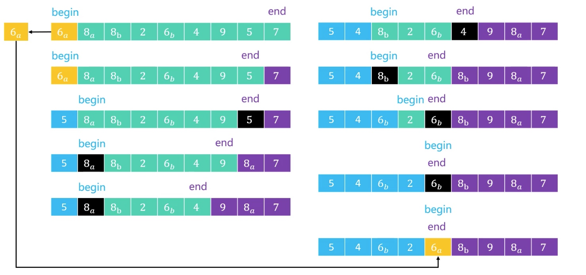

# 快速排序

流程：
1.从序列中选择轴点元素pivot
2.利用轴点将序列分割为两个子序列，小于pivot元素放前面，大于轴点元素的放后面
3.对子序列进行1，2操作
直到不能分割（子序列中只剩下一个元素）

本质：
逐渐将每个元素都转换为轴点元素




```java
	public static  int pivotIndex(int array[],int begin, int end) {
		int pivot = array[begin]; //可随机，与begin交换
		end --;
		while(begin < end) {
			while(begin < end) {
				if(array[end]> pivot) {
					end --;
				}else {
					array[begin] = array[end];
					begin++;
					break;
				}
			}
			while(begin < end) {
				if(array[begin] < pivot) {
					begin ++;
				}else {
					array[end] = array[begin];
					end --;
					break;
				}
			}
		}
		array[begin] = pivot;
		return begin;
	}
	
	//左闭合右开
	// [begin  mid) [mid+1 end);
	public static void quickSort(int array[], int begin , int end) {
		if(end - begin < 2) return;
		int mid = pivotIndex(array, begin, end);
		quickSort(array,begin,mid);
		quickSort(array,mid+1,end);
	}
```

# 冒泡排序

执行流程

1.从头开始比较每一对相邻元素，如果第一个比第二大，就交换他们的位置
执行完一轮，末尾那个元素就是最大的

2.忽略1中找到元素，重复执行1，直到全部元素有序

优化：
如果序列尾部已经局部有序，记录最后一次位置，减少比较次数

```java
  /*
     * # 冒泡排序
     * 
     * */
	public static void BubbleSort(int array[]) {
		for(int end = array.length - 1; end > 0; end -- ) {
			int sortedIndex = 1;
			for(int begin = 1; begin <= end; begin++) { //经过一次排序，最后一个当次排序最大
				if(array[begin] < array[begin-1]) { // ai > ai+1 交换  12 2 > 2 12升序
					int temp = array[begin];
					array[begin] = array[begin-1];
					array[begin-1] = temp;
					sortedIndex = begin;
				}
			}
			end = sortedIndex; //经过一次交换，最后一次交换之后的数据已经是有序的了
		}
	}
```

# 选择排序
- 执行流程

1. 从序列中找到最大的元素，然后和末尾元素交换位置
执行一轮，最末尾的那个元素就是最大的了

2. 忽略找到最大的元素，重复执行步骤1

- 效率
最好，最坏，平均时间复杂度都是0（n^2）
交换次数远远比冒泡排序少，平均性能优于冒泡排序

```java
/*
	 * 
	 * 选择排序
	 * 从序列中找出最大的元素，与最末尾的元素交换
	 * 
	 * */
	public static void SelectionSort(int array[]) {
		for(int end = array.length - 1; end > 0; end --) {
			int maxIndex = 0;
			for(int begin = 1; begin <= end; begin ++) {
				if(array[maxIndex] <= array[begin]) {
					maxIndex = begin;
				}
			}
			int tmp = array[maxIndex];
			array[maxIndex] = array[end];
			array[end] = tmp;
		}
	}
```

# 归并排序


