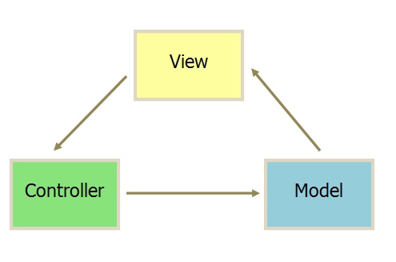
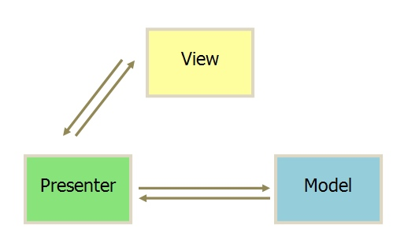
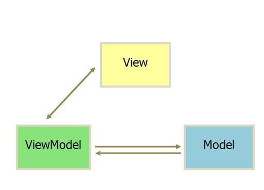

# 参考资料
[阮一峰的MVC等图示](http://www.ruanyifeng.com/blog/2015/02/mvcmvp_mvvm.html)
[MVX系列](https://draveness.me/mvx/)

# MVC

- **组成部分**

视图（View）： 用户界面
控制器（Controller）：业务逻辑
模型（model）： 数据保存

- **通信方式**：

1. View 传送指令给Controller
2. Controller 完成业务逻辑后，要求model改变状态
3. model 将新的数据发送到View，用户得到反馈

所有通信都是单向的

接收指令的方式：
1. 用户通过View
2. 通过Controller接收

# MVP

1. 各部分通信都是双向的
2. View 和 Model 不发生联系，都是通过Presenter传递
3. View 非常薄，Presonter非常厚

# MVVM

Presenter 改为ViewModel ，基本与MVP一致

区别在于，它采用双向绑定，View的变动，自动反映在ViewModel上，反之亦然。
Angular

