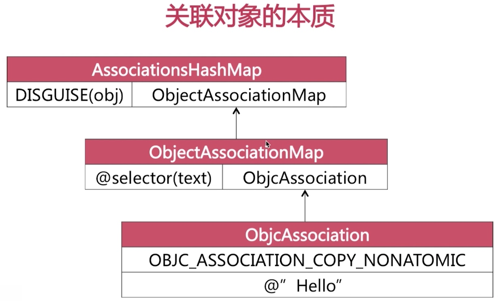
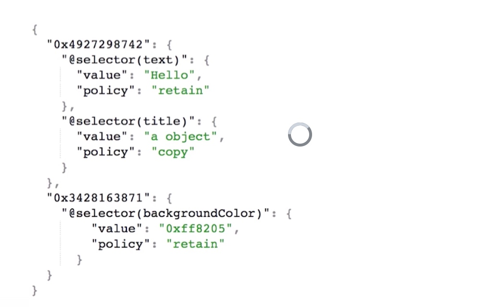
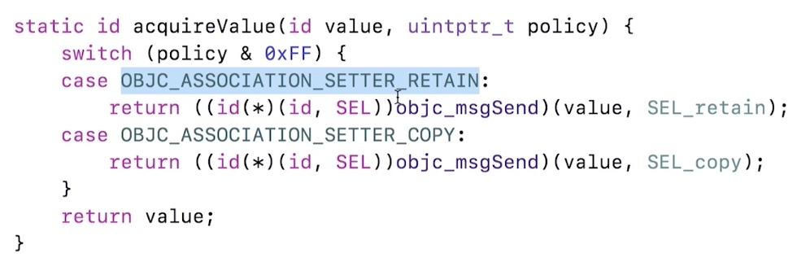
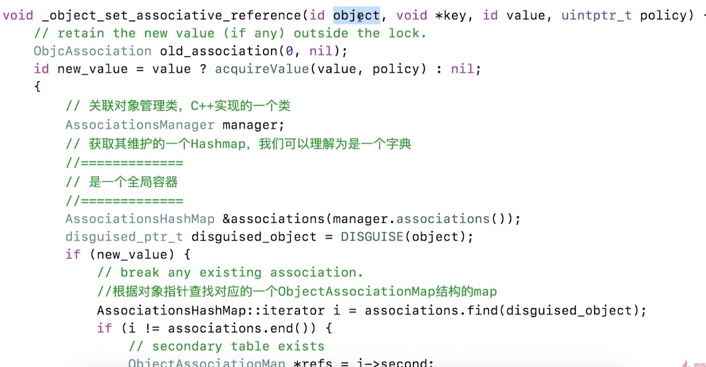
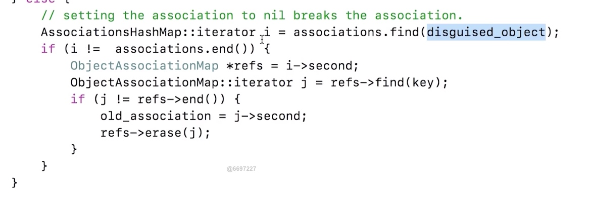

# 相关函数

```
objc_setAssociatedObject(id _Nonnull object, const void * _Nonnull key,
                         id _Nullable value, objc_AssociationPolicy policy);
                         
objc_getAssociatedObject(id _Nonnull object, const void * _Nonnull key);

objc_removeAssociatedObjects(id _Nonnull object)                        
                         
```
# 实现原理

关联对象由AssociationsManager 管理并在AssociationsHashMap存储。所有关联对象的关联内容都在同一个容器中。

1.
AssociationsHashMap 哈希查找到 ObjectAssociationMap （key：对象 value ObjectAssociationMap）
2.
ObjectAssociationMap 再到 ObjcAssociation 

key： 关联的key value  ObjcAssociation

3：
ObjcAssociation：
关联策略 关联值







关联策略，会对对象发送消息retain或者copy






撤销关联值，设置nil值就可以了


