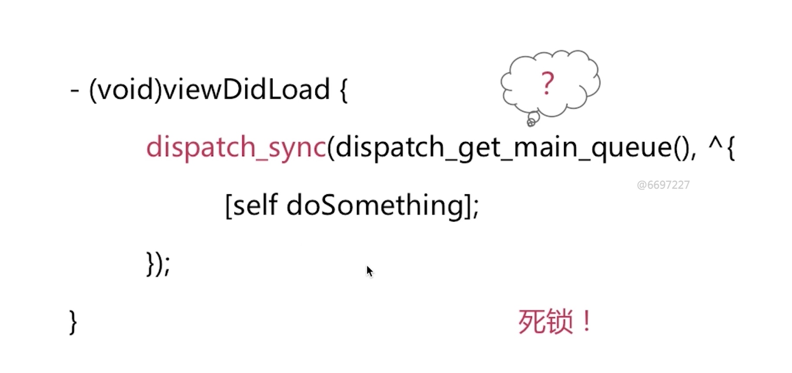
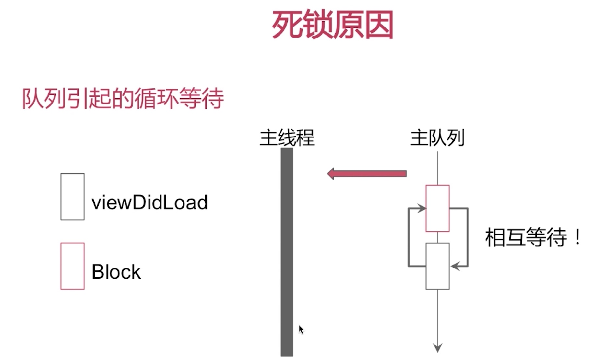
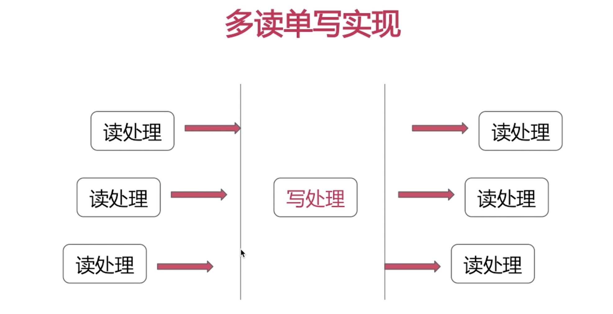
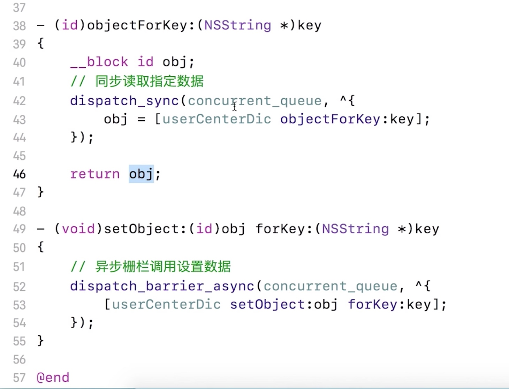
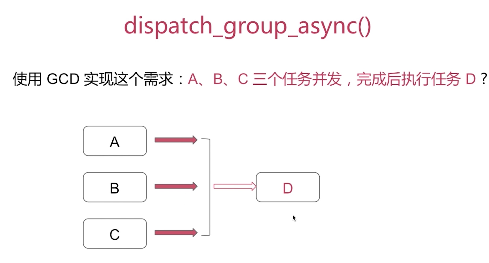
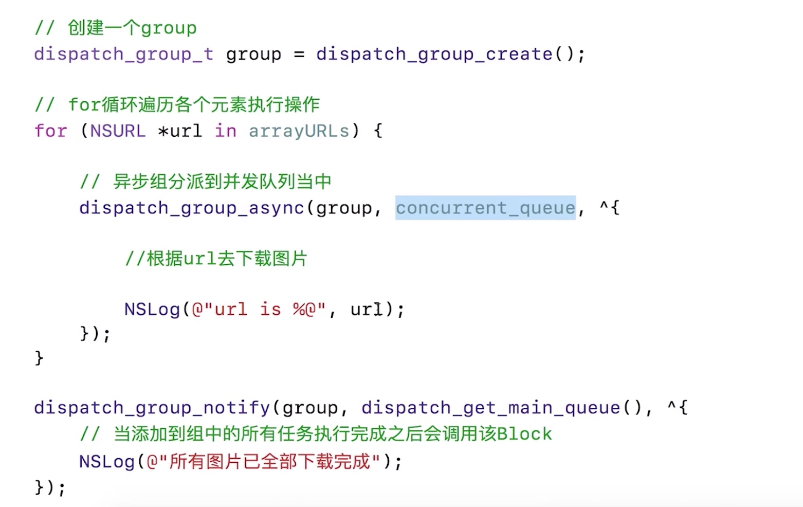

# 异步同步
参考：[GCD的异步同步](http://www.cocoachina.com/articles/22433)

[同步与阻塞的区别与联系](http://www.cocoachina.com/articles/28201)

## 队列

串行队列:
任务先进先出，**前一个任务执行完再执行后面的下一个任务**

并发队列：
任务可以**并发执行，无序的**

## 任务调用方式

同步调用：
调用一个函数时，**立刻得到一个结果**，并进行后续操作

异步调用：
**并不能立刻得到一个结果**，需要等函数运行完成后，通过回调函数，代理事件，通知等方式告诉我们


## 死锁问题

**队列引起的循环等待**


相互等待
ViewDidLoad**需要立即执行**Block 才能执行完
Block需要执行，需要等待ViewDidLoad执行完：串行队列的特点，前一个任务执行完，后续一个任务才会执行




# GCD 栅栏 （多读单写）







dispatch_barrier_async

dispatch_barrier_async函数的作用与barrier的意思相同,在进程管理中起到一个**栅栏的作用**,它**等待**所有位于barrier函数之前的操作**执行完毕后执行**,并且在**barrier函数执行之后,barrier函数之后的操作才会得到执行**,该函数需要同dispatch_queue_create函数生成的concurrent Dispatch Queue队列一起使用

```Objetive-c
- (void)barrier
{
　　//同dispatch_queue_create函数生成的concurrent Dispatch Queue队列一起使用
    dispatch_queue_t queue = dispatch_queue_create("12312312", DISPATCH_QUEUE_CONCURRENT);
    
    dispatch_async(queue, ^{
        NSLog(@"----1-----%@", [NSThread currentThread]);
    });
    dispatch_async(queue, ^{
        NSLog(@"----2-----%@", [NSThread currentThread]);
    });
    
    dispatch_barrier_async(queue, ^{
        NSLog(@"----barrier-----%@", [NSThread currentThread]);
    });
    
    dispatch_async(queue, ^{
        NSLog(@"----3-----%@", [NSThread currentThread]);
    });
    dispatch_async(queue, ^{
        NSLog(@"----4-----%@", [NSThread currentThread]);
    });

```

输出结果:1 2 --> barrier -->3 4  其中12 与 34 由于并行处理先后顺序不定

# dispatch_group_async




# dispatch_group

dispatch_group_notify 当添加到组中的任务执行完成后，才会执行notify里的Block



# GCD 任务如何取消
[https://www.jianshu.com/p/c45f099c7fd4](https://www.jianshu.com/p/c45f099c7fd4)

1. dispatch_block_cancel

   iOS8之后可以调用dispatch_block_cancel来取消（需要注意必须用dispatch_block_create创建dispatch_block_t，dispatch_block_cancel**也只能取消尚未执行的任务，对正在执行的任务不起作用**。

2. 定义外部变量，用于标记block是否需要取消


