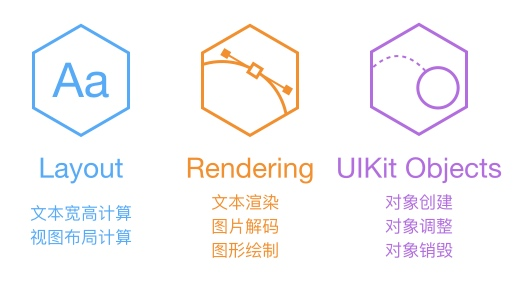

阅读笔记：[iOS 保持界面流畅的技巧](https://blog.ibireme.com/2015/11/12/smooth_user_interfaces_for_ios/)

# 显示原理
CRT 显示器原理，当电子枪换到新的一行的时候，会发出一个同步水平同步型号HSync，当绘制完一帧后，在准备画下一帧之前，会发送一个垂直同步信号VSync

# 卡顿原因
在VSync 信号到来后，系统会通过CADisplayLink 等机制通知App， App主线程开始计算显示内容，比如：
视图的创建、布局计算、图片解码、文本绘制等

随后会把内容提交到GPU，GPU进行：
变换、合成、渲染

GPU将渲染结果提交到帧缓冲区内，等待下一次VSync。由于垂直同步机制，如果在一个VSync的时间内，CPU或者是GPU没有完成内容提交，那一帧就会被丢弃，显示屏保留原来的内容，造成卡顿

# CPU 




## 对象的创建
对象的创建会分配内存、调整属、甚至读取文件，比较消耗CPU资源

- 不需要触摸事件的空间，用CALayer会比较合适。
-  如果对象不涉及UI操作，尽量放到后台线程创建
-  对性能敏感的界面，不选用Storyboard
-  推迟对象的创建时间，分散多个任务
-  复用可以复用的对象

## 对象的调整
CALayer： 内部没有属性，当调用属性方法时，内部通过运行时resolveInstanceMethod 动态临时添加方法，并把对应的属性保存到内部的Dictionary中，同时还会通知Delegate，创建动画，非常消耗资源。

-  尽量视图层次调整，添加和移除视图

## 对象的销毁

可以移到后台释放就移到后台释放


```Objective-C
NSArray *tmp = self.array;
self.array = nil;
dispatch_async(queue, ^{
    [tmp class];
});
```

## 布局计算  文本计算
后台线程提前计算好布局

## 图片的解码
图片设置到UIImageView 或者CALayer.contents中去，并且CALyaer提交到GPU之前，CGImage中的数据才会得到解码。

在后台把图片绘制到CGBitmapContext中，然后从Bitmap中直接创建图片

## 图像的绘制
```Objective-C
- (void)display {
    dispatch_async(backgroundQueue, ^{
        CGContextRef ctx = CGBitmapContextCreate(...);
        // draw in context...
        CGImageRef img = CGBitmapContextCreateImage(ctx);
        CFRelease(ctx);
        dispatch_async(mainQueue, ^{
            layer.contents = img;
        });
    });
}
```

# GPU

GPU所做的事情是，提交纹理（Texture）和 顶点描述（三角形），应用变换（transform），混合并渲染，然后输出到屏幕。
两类：
纹理（图片）和 形状（三角模拟的矢量图）
变换、混合 ------》 输出


## 纹理的渲染

所有的Bitmap： 图片、文本、栅格化的内容，都会提交到显存，绑定为GPU（Texture）。

目的：减少纹理的渲染
TableView：快速滑动的时候
多张图片，合成一张图片显示

## 视图的混合

多个视图（CALayer）重叠在一起的时候，GPU首先会把他们混合在一起，视图过于复杂的时候，会消耗很多GPU资源

- 方法：

减少视图数量和层次
不透明的视图使用opaque属性避免无用Alpha 通道合成，（添加背景颜色）
多个视图预先渲染为一张图

## 图形的生成


CALayer 的 boder，圆角、阴影、遮罩，CASharpLayer 的矢量图显示，通常会**离屏渲染**。

后台绘制图片
避免使用


