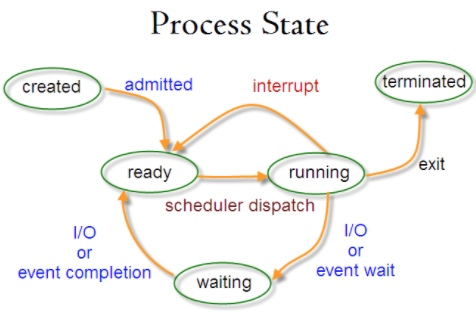
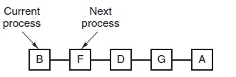
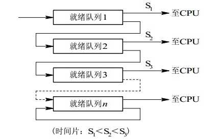
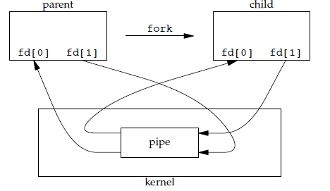

# 进程与线程

## 进程
进程是**资源分配的基本单位**
进程控制块（Process Control Block，PCB）描述进程的基本信息和运行状态，所谓创建进程和撤销进程，都是针对PCB的操作

## 线程
线程是**独立调度的基本单位**

一个进程可以有多个线程，他们共享进程资源


## 区别

1. 拥有资源
进程是资源分配的基本单位，但是线程不拥有资源，线程可以访问隶属进程的资源

2. 调度
线程是独立调度的基本单位，同一个进程中，线程切换不会引起进程切换

3. 系统开销
创建或者销毁进程时，系统都要为之分配或回收资源。比如内存空间、I/O 设备等
进程切换时候： 涉及当前执行进程CPU环境的保存以及新调度进程CPU环境设置
线程切换： 只需保存和设置少量寄存器内容，开销小


4. 通信
线程间可以通过直接读写同一进程的数据进行通信，但进程通信需要借助IPC

# 进程状态的切换



- 就绪状态： 等待调度
- 运行状态
- 阻塞状态： 等待资源

注意：
- 只有**继续态和运行态**可以相互转换，其他都是单向转换。就绪状态的进程通过调度算法从而获得CPU时间，转为运行状态。而运行状态的进程，分配给它的CPU时间片用完之后就会转为就绪状态，等待下一次调度。
- 阻塞状态是缺少需要的资源从而由运行状态转换而来，但是该资源不包括CPU时间，缺少CPU时间会从运行状态转为就绪状态

# 进程调度算法

## 批处理系统

### 先来先服务FCFS（first-come first-serverd）
非抢占式的调度算法，按照请求的顺序进行调度

有利于长作业，但不利于短作业，以为短作业必须一直等待前面的长作业执行完毕才能执行，等待时间过长

### 短作业优先 SJF （shortest job first）
非抢占式的调度算法，按估计运行时间最短的顺序调度。

长作业可能会饿死，处于一直等待短作业执行完毕的状态。因为如果一直有短作业到来，那么长作业执行完毕才能执行。

### 最短剩余时间优先 shortest remaining time next （SRTN）

按剩余运行进程时间的进行调度

## 交互式系统
交互式系统有大量的用户操作，在该系统中调度算法的目标是进行响应

### 时间片轮转
将所有就绪进程按FCFS的原则排成一个队列，把CPU时间分配给队首进程，该进程执行一个时间片。当时间片用完时，由计时器发出时钟中断，调度程序便停止该进程的执行，并把它送进就绪队列的末尾。

效率和时间片大小很大的关系：
- 进程的切换保存进程的信息并载入新进程的信息，如果时间片太小，进程切换太频繁，进程切换会花太多时间
- 如果时间片过长，实时性不能保证



### 优先级调度
为每个进程分配，按优先级进行调度
为了防止低优先级进程永远等不到调度，可以随着时间的推移增加等待进程的优先级

### 多级反馈队列

设置多个队列，每个队列时间片大小都不同，例如1，2，4，8.... 



# 进程通信
进程同步和进程通信区别：
- 进程同步： 控制多个进程按一定顺序进行
- 进程通信： 进程间传输信息

## 管道
管道通过调用pipe函数创建，fd[0]读，fd[1]用于写

```c++
#include <unistd.h>
int pipe(int fd[2]);
```

1. 只支持半双工通信（单向交替传输）
2. 只能在父子进程或者兄弟进程中使用



## FIFO命名管道

去除了只能在父子进程中使用的限制

## 消息队列
## 信号量
## 共享存储
## 套接字