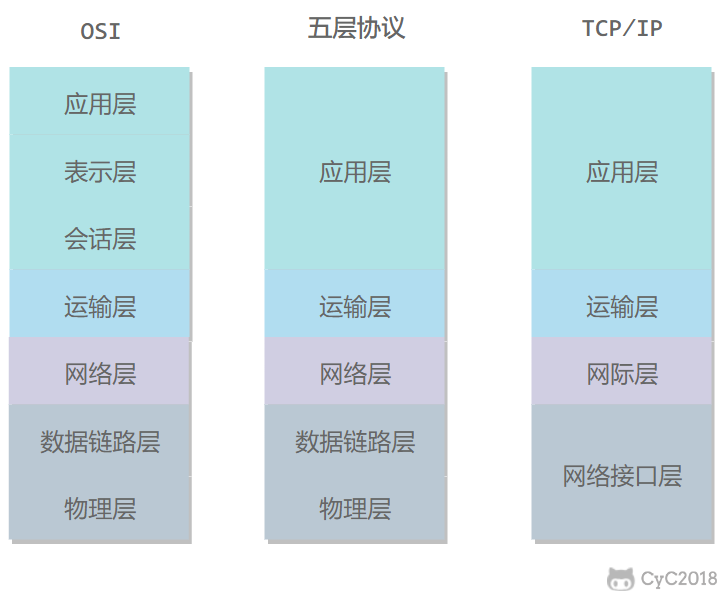
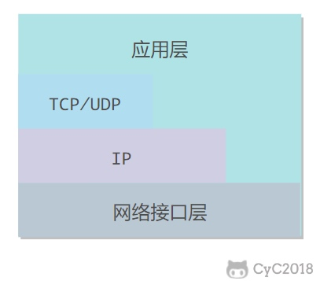

# 网络体系结构

## 五层协议

- 应用层 ： 为特定的**程序**提供数据传输服务，例如HTTP，DNS ，数据单位为**报文**

- 传输层： 为**进程**提供通用数据传输服务，包括TCP，UDP

- 网络层： 为**主机**提供数据传输服务，网络层把传输层传下来的报文段和用户数据报封装成**组**

- 数据链路层： 为同一链路的主机提供数据传输服务，把网络层传下来的分组封装层**帧**

- 物理层： 考虑怎么在传输媒体上传输数据**比特流**

[概念区别](https://blog.csdn.net/a3192048/article/details/84671340)

## OSI

- 表示层 ： 数据压缩，加密以及数据描述
- 会话层： 建立以及管理会话

## TCP/IP

应用层： 可能直接使用IP，网络接口层

