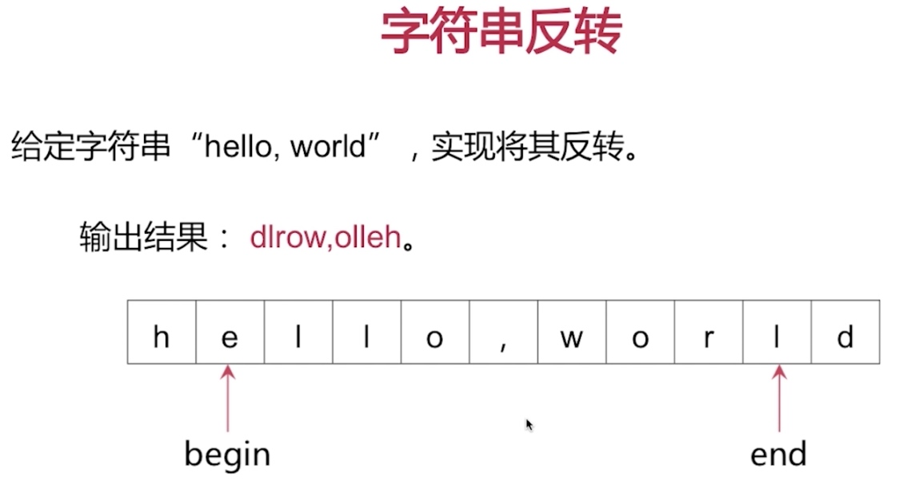
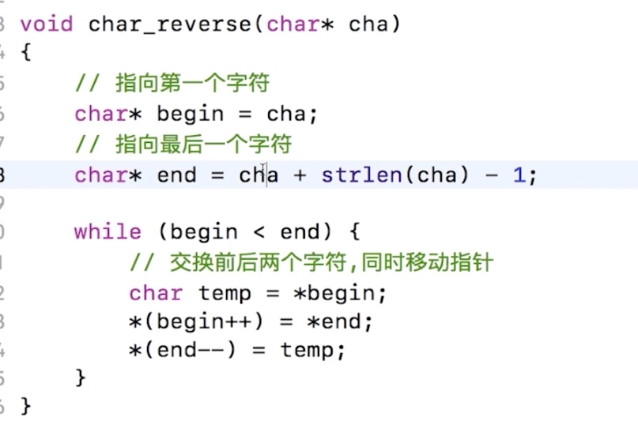

# 整数反转
https://leetcode-cn.com/problems/reverse-integer/

输入：x = 123
输出：321
```java
public int reverse(int x) {
        int r = 0;
        while(x!=0) {
            int tmp = r;
            r = r * 10 + x%10;
            x/=10;
            if(r/10 != tmp) return 0; //防止超出范围
        }
        return r;
    }
```

# 字符串反转



