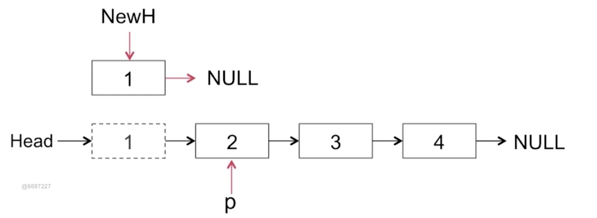

# 快慢指针(判断链表是否有环)

https://leetcode-cn.com/problems/linked-list-cycle/

```
        if(head == null || head.next == null) return false;
        //快慢指针
        ListNode slow = head;
        ListNode fast = head.next;
        while(fast != null && fast.next != null) {
            slow = slow.next; //慢指针走一步
            fast = fast.next.next; //快指针走两步
            if(slow == fast) return true;
        }
        return false;
```

# 反转链表
https://leetcode-cn.com/problems/reverse-linked-list/

## 迭代方式


```java
  public ListNode reverseList(ListNode head) {
        if(head == null || head.next == null) return head;
        ListNode newHead = null;
        //头插法
        while(head!=null) {
            ListNode tmp = head.next; // 记录下一个节点
            head.next = newHead; // 当前节点指向新链表头部
            newHead = head; // 更改当前节点为新链表头部
            head = tmp;//指向下一个节点
        }
        return newHead;

    }
```